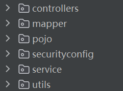
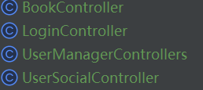
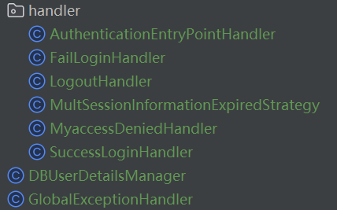
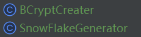
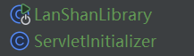
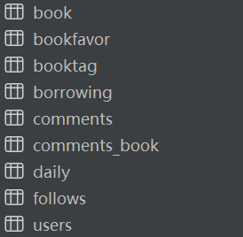

# 蓝山Java后端2025寒假单人考核项目

2025.1.30第一次更新，上传了初始demo

2025.1.31第二次更新，修复了并发登陆拦截不了的bug

2025.2.1第三次更新，新增了上传图片的大小与类型限制

2025.2.2第四次更新，增加了对重复登陆的阻止与csrf的支持，并美化了登录界面

## 0.项目简介：

**蓝山图书馆管理系统** ，~~常驻嘉宾了属实是~~  

* 使用了SSM来构造项目

* 采用了Spring Security作为框架，Session来实现认证及持久化访问,启用了cors，可随时启用csrf
* 采用了MySQL来操作数据，~~并在遭受了SQL勒索后靠着定时备份恢复~~
* 评论，动态，用户，书籍等均采用具有唯一用雪花算法生成的ID进行管理
* 安全且高效的数据库
* 具有详细且全面的关于请求的错误的反馈

> **用户管理方面**：实现了用户和管理员的分离，并提供注册，增加管理员，查询用户，更改用户名/密码等功能；

> **社交方面**：实现了简单的社交功能，可以自定义头像及自我介绍，并提供关注及动态上传和评论功能；

> **图书管理方面**：实现了图书的增删改查，高级搜索，自定义标签，借阅系统，评分及评论系统，以及一个简单的推荐系统；

全部接口均按照**REST**标准编写。

已经部署在了121.40.101.83/LanShanLibrary

**我提供了一套体验请求于仓库中，导入PostMan即可**

---

---

-----

## 1.项目结构:

> 总体分为六类：**controllers   mapper   pojo  securityconfig   service   utils**

----

### controllers :

> 控制器类

顾名思义，是各种控制器，里面又分为：

> BookController

* 包含了对图书操作的接口。

> LoginController

* 登录接口

> UserManagerController

* 包含了用户管理的接口

> UserSocialController

* 包含了关于社交功能的接口

---

### mapper:

> SQL的mapper

里面是Mybatis的mapper，并没有映射到xml而是直接通过注释的方式给出看SQL语句。

----

### pojo：

> 信息数据模版类

包含了几个模版类，分别对应各种数据类型的模版

----

### securityconfig:

> Spring Security

里面一个配置类：**WebSecurityConfig**，包含了对Spring Security的各种自定义设置，自定义了过滤授权链，以及对权限不足，访问未授权的接口等各种情况的跳转页面及处理方法。

---

### service:

> 内有handler子目录
>
> 是对于登陆失败，权限不够等各种情况的处理器

**DBUserDetailsManger**是自定义UserDetail的类，用以实现从数据库获取账户信息认证并自定义户凭证信息列表，比如加入用户的ID

**GlobaExceptionHandler**是全局异常处理器，我其实在每个controller都加了比较充分的异常处理，这个作用是处理我没想到的异常

-----

### utils:

> 内含工具类

内含雪花算法生成ID的工具 SnowFlakeGenerator

以及BCrypt加密器：BCryptCreater

------

### 杂项：

> 启动类LanShanLibrary以及打包类ServletInitializer

-----

-----

-----

## 2.数据库结构与介绍

### 安全性：

> 在经历了SQL勒索删库后痛定思痛，大幅改进了数据库：

* 密码采用最高等级的安全策略
* 不用默认的3306端口，改成其他不常见的端口
* root用户不对外部开放，专门新建一个只有library库的权限的用户用于外部连接
* 定时备份数据库（虽然没啥数据但那么多表建起来挺烦的）
* 均采用`#{}` 防止 SQL 注入

### 表介绍：

命名通俗，应该能见名思意，吧。

对于动态，书籍，评论，借阅书籍这些具有关联性的数据，都设置了合适的主键，外键与索引

比如当一个动态被删除后，对应的评论也会被删除，借阅书籍，关注，书籍标签同理

------

---

---

## 3.API介绍

### 用户管理区:

> /login

* 朴实无华的登陆接口
* 其中分为post,与get两个不同的接口，get会返回登录界面，post会转发给loginProcessingUrl,我设置成了/dologin
* 这样能检测重复登陆，但是不开启csrf的话可以直接post到/dologin来跳过验证
* 如果要用postman测试的话，需要先get一下拿到_csrf再加到post请求中才可登陆，后续操作也要加上
* 为了测试方便我就先关了csrf，可随时开启

> /user/add

* 管理员才能用的接口，新建一个具有admin权限的用户

> /user/register

* 未认证也可用，注册一个具有user权限的用户

> /user/delete

* 删除用户，只有管理员可使用

> /user/list

* 获取用户列表，根据是不是管理员判断给不给出密码（虽然也是加密过的）

> /user/status

* 查看当前登陆的账户的详细信息

> /user/account

* 更改指定账户的用户名，密码，非管理员只能改自己的

### 用户社交区:

>/users/upheadimg

* 为当前用户上传头像，存储在服务器上，目前并无安全检测~~（我不会）~~
* 图像采用当前用户的ID命名

> /users/headimg

* 获取当前用户的头像，如果没有头像会用默认头像代替

> /users/profile

* 获取用户的账户社交信息，包括签名，动态及其评论

> /users/updateinfo

* 上传当前账户的自我介绍

> /users/follow

* 以当前账户关注某人，再次关注会取关

> /users/follows

* 查看谁关注了某人

> /users/following

* 看某人关注了谁

> /users/updaily

* 上传动态

> /users/delcontents

* 删除内容（动态或评论）

> /users/getdaily

* 获取动态内容及其评论

> /users/addcomment

* 发表评论

### 图书管理区

> /book/add

* 添加图书，只有管理员可使用

> /book/delbook

* 删除图书，同样只有管理员可使用

> /book/update

* 更新图书，图书ID必给，其他给什么更新什么

> /book/list

* 图书列表，不会给出详细信息，可自定义页数，排序规则，按什么排序，默认一页展示5本，按name降序

> /book/getbook

* 获取一本书的详细信息，包括评论，分数等

> /book/advget

* 高级搜索，给什么就按照什么过滤，包括但不限于评分区间，出版时间区间

> /book/statistics

* 统计所有图书

> /book/addfavor

* 将一本图书加到此账户的收藏夹中，再次加入会移出

> /book/recommendations

* 简单的推荐，根据收藏夹中最多的label进行随机推荐，不会推荐到收藏夹中已有的书，如果收藏夹没书就会随机一本

> /book/addtag

* 给一本书加标签

> /book/addcomment

* 给一本书评论，可以加评分也可以不加，图书将取所有评论评分的平均值

> /book/delcomment

* 删除评论，非管理员只能删自己的

> /book/borrowing

* 借阅指定图书，已经借过或借完了会拒绝，默认借5个月

> /book/return

* 归还图书

> /book/checkBorrow

* 查看当前账户的借阅情况

## 4.结尾

* 基本内容就是这么多，还是学到了不少东西，就是后悔应该找个前端合作的，这么多东西不做个GUI太可惜了，，，

* 规范编码很重要，从一开始就要想好后面怎么拓展，因为这个重写了好几回

* pojo 一定不能省，比如不能用简单粗暴的 **ImmutablePair<Object,Long>**这种类型的返回值而不专门做个pojo会导致想拓展及维护很困难

* 数据库一定要安全性拉满，公网服务器很容易被攻击

* 貌似交得有点早了，还有好多功能想实现......
